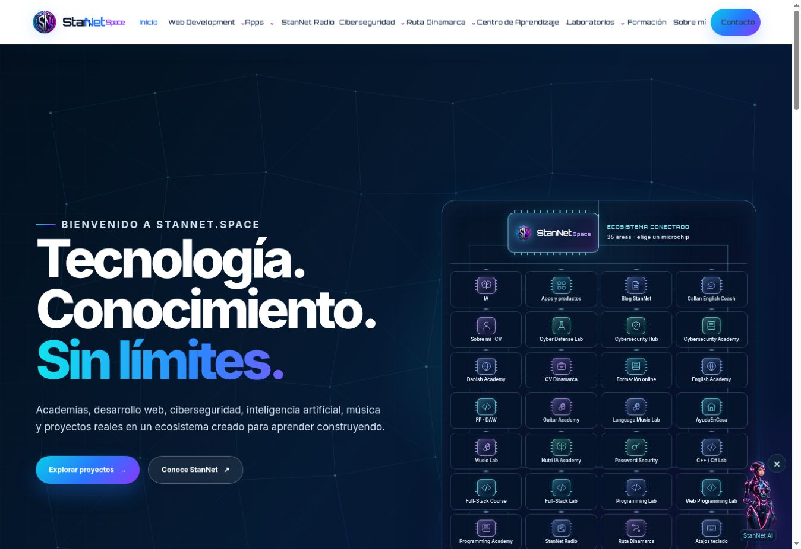
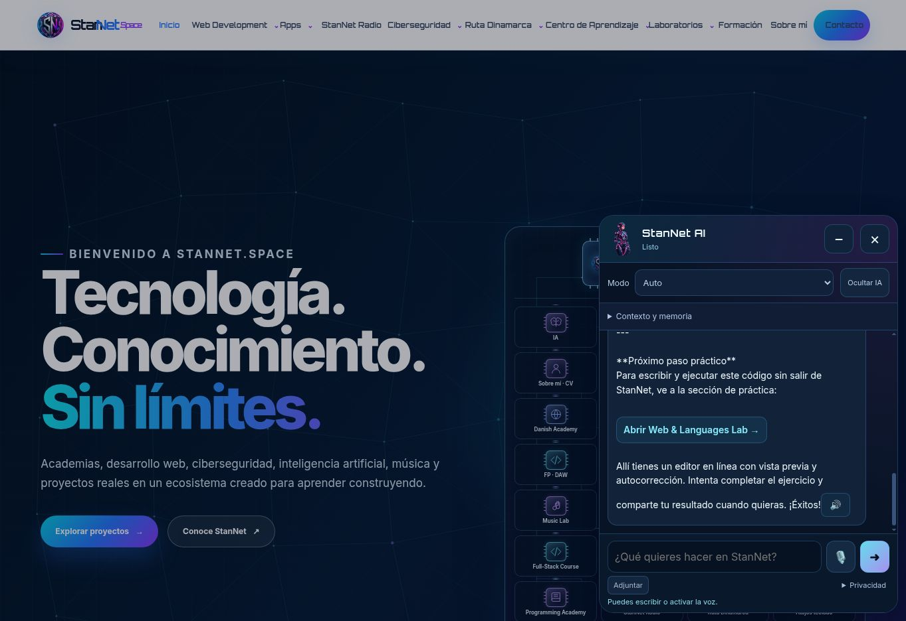

# StanNet AI — consolidación del 5 de octubre de 2026

Código publicado: `5001cdb99879c783e559e46b221e52e6b2178f22` y `bec699086271f8316a6cbdb44785204490fe4b5a`. La segunda revisión conserva la primera y corrige memoria desplegada y búsqueda de cursos. Se trabajó en un worktree aislado, partiendo de `cf9aafa09205dad6508f02ae0355465e55df5079`, con el repositorio limpio y `main` remoto comprobado. No hubo reset, rollback general ni cambios en contenidos de otras áreas.

## 1. Causa del fallo

Los cambios anteriores habían mezclado las dimensiones del personaje y del panel, acumulado CSS inline y responsive, y anclado el panel a un launcher dentro de elementos contenidos/transformados. El historial documenta además el cálculo antiguo `64vh` con `bottom:126px`, incompatible con el espacio que deja el teclado.

La reconstrucción de madrugada ya había aislado el panel mediante Shadow DOM y `dialog.showModal()`, y recuperado historial, adjuntos, voz y memoria. Sin embargo, su regla móvil asignaba todo el ancho y alto del VisualViewport, y la chica solo existía en la cabecera: aún incumplía el panel compacto y el personaje flotante solicitados. Tampoco tenía preferencia de ocultación persistente.

Una prueba adicional encontró que abrir memoria en 844×390 dejaba la conversación sin espacio útil. Su altura dependía del viewport completo en vez del área central disponible. Se corrige con un límite del 50% de ese centro; en viewports menores de 380px de alto se oculta temporalmente, conservando su estado abierto.

## 2. Referencia avanzada localizada

- `a86a154`: agente guiado del 4 de octubre, 22:50 hora de Madrid; modos, memoria, contexto, adjuntos y voz.
- `a3e0d5f`: adaptación de esa interfaz a la paleta StanNet, 5 de octubre, 00:47.
- `89a9218`: integración posterior de la chica.
- `cf9aafa`: base actual con núcleo y conocimiento separados, aislamiento visual y correcciones de VisualViewport.

Los commits antiguos permiten identificar capacidades y comportamiento; no se afirma que hayan sido probados retrospectivamente en teléfonos físicos.

## 3. Recuperación y limpieza

Se recupera el personaje flotante y su control independiente, con la estética cian/violeta de la interfaz avanzada. Se conserva el núcleo actual y sus funciones reales. Se elimina la regla de pantalla completa en móvil y se reemplaza el botón IA permanente por el componente de presentación del personaje.

El robot CSS, las reglas inline duplicadas y los antiguos overrides del agente ya habían sido retirados en la reconstrucción anterior. No se borran nuevamente archivos o funciones por considerarlos legacy sin comprobarlos. Hay un montaje, una hoja de estilos y un loader compartido; la fixture reproduce los selectores antiguos para verificar que ya no interfieren.

## 4. Archivos modificados

| Archivo | Responsabilidad |
| --- | --- |
| `stannet-ai-avatar.mjs` | Nuevo componente independiente de personaje, ocultación y restauración |
| `stannet-ai.js` | Integra presentación, panel, estados y cierre |
| `stannet-ai.css` | Geometría compacta, personaje transparente y memoria acotada |
| `stannet-ai-core.mjs` | Estados de actividad y manejo de errores |
| `stannet-ai-knowledge.mjs` | Categoría, disponibilidad, IA y búsqueda exacta de recursos |
| `stannet-ai-loader.js` | Versión compartida `20261005-agent7` |
| `script.js`, `stannet-global-nav.js` | Actualizan únicamente la versión de ese loader |
| `qa/stannet-ai/browser.mjs` | Matriz ampliada y regresión de memoria/teclado |
| `qa/stannet-ai/fixture.html` | Historial de prueba aislado que persiste al recargar; respuesta larga determinista |
| `qa/stannet-ai/index.html` | Selector de tamaños y botón de regresión |
| `tests/stannet-ai-catalog.test.cjs` | Rutas reales y selección de danés, JavaScript, C++ y C# |
| `tests/stannet-ai-core.test.mjs` | Estados de error y recuperación, además del contrato existente |
| `package.json` | Incluye comprobación sintáctica del avatar y del runner de navegador |
| `docs/stannet-ai-reconstruction.md` | Marca el informe de madrugada como histórico |
| Este informe y evidencias | Resultado y límites de la verificación |

No se modificaron `worker.js`, la portada, el átomo, el menú general, Radio, Studio ni el contenido de las academias en esta consolidación. Los dos cambios de bootstrap están limitados a la versión del agente.

## 5. Responsive y teclado

Un único cálculo dimensiona el panel a `min(450px, ancho visual − márgenes − safe areas)` y `min(600px, alto visual − márgenes − safe areas)`. Posición, altura y ancho usan los offsets del VisualViewport, actualizados en requestAnimationFrame al cambiar tamaño, scroll u orientación. No se añaden transformaciones al panel ni listeners que cancelen gestos táctiles.

El panel conserva su header, modos, centro flexible y formulario. La conversación tiene altura mínima cero, scroll vertical, límites de anchura y ajuste de palabras largas. Los mensajes no se encogen. En alturas muy reducidas se priorizan cabecera, conversación y entrada; los controles secundarios vuelven cuando hay espacio.

El diálogo está en la capa superior del navegador y bloquea reversiblemente la página de fondo. El personaje utiliza su propia superficie popover manual en esa misma capa: el `contain` de la web no puede desplazarlo. No se enfoca automáticamente el input en dispositivos táctiles. Cerrar detiene voz y audio y restaura el scroll de la página.

## 6. Chica → panel → ocultar → IA → restaurar

1. Sin preferencia previa de ocultación, aparece la chica transparente, de tamaño discreto, con su botón de ocultar.
2. Pulsarla abre el panel; el personaje se retira mientras el panel está abierto.
3. Cerrar, minimizar o Escape devuelve el personaje y conserva la conversación.
4. El botón del personaje o «Ocultar IA» del panel oculta tanto personaje como panel. Solo queda IA.
5. La elección se guarda en `stannet-ai-avatar-hidden-v1` de localStorage y se respeta al recargar o navegar entre páginas.
6. IA restaura únicamente la chica; tocarla de nuevo abre la conversación.

El asset existente es una imagen RGBA incrustada en SVG, 130×195 px, con alfa de 0 a 255. Se reutiliza sin edición ni generación y sin fondo de launcher. En móvil se muestra a 68×102 px; en escritorio a 78×117 px.

## 7. Arquitectura del agente

- **Avatar:** `AgentAvatar` gestiona `idle`, `open` y `hidden`, preferencias, pulsación y control del personaje. No dimensiona ni renderiza mensajes.
- **Panel:** la interfaz aislada gestiona conversación, controles, scroll, input, viewport, adjuntos, memoria y voz existentes.
- **Agent Core:** orquesta descubrimiento local y transporte a `/api/stannet-ai`; conserva contexto de página, historial, memoria optativa, cancelación por timeout y bloqueo de turnos simultáneos. Expone estados `thinking`, `idle` y `error`.
- **Tools:** registro explícito `search` y `openResource`, con enlaces visibles. No se ejecutan instrucciones de navegación ni código arbitrario procedentes del modelo.
- **Voice:** conserva dictado por SpeechRecognition/WebKit, salida por `/api/speech` y fallback del navegador; el panel expone `listening` y `speaking`.
- **Memory / Tutor:** se conservan preferencias optativas y continuidad de conversación. El núcleo permite extender capacidades después; no se anuncian nuevas herramientas, progreso académico o autonomía todavía no implementados.

## 8. Knowledge

Catálogo único compartido por navegador y backend con `id`, `title`, `path`, `description`, `keywords`, `category` y `available`. Todas las rutas internas del catálogo se comprueban contra archivos reales en la suite.

Incluye academias de programación, Python, HTML/CSS/JavaScript, C++/C#, ciberseguridad, Sentinel, Shield, contraseñas, Radio, Studio/Vocal Lab, IA, Web Development, Apps, proyectos, formación, CV, YouTube, Callan, inglés, Danish Academy y Ruta Dinamarca.

Se añade explícitamente `/pages/ai.html`. JavaScript dirige al laboratorio docente `/pages/programming-web-lab.html`. Danés responde localmente con `/pages/danish.html`, incluso sin API. La búsqueda usa palabras/expresiones completas: «estudio C#» ya no coincide con el keyword «studio». Los enlaces externos se restringen al catálogo y se rechazan protocolos inseguros.

## 9. Capacidades conservadas

Voz y reproducción de respuestas; memoria optativa; historial persistente; adjuntos de imágenes y código; cinco modos (Auto, General, Programación, Ciberseguridad y Viajes); contexto de página; endpoint y proveedor existentes; análisis de imágenes y herramientas del backend previamente disponibles. No se cambia la exclusión del Studio establecida anteriormente por el sitio.

## 10. Pruebas de navegador

Matriz completa repetida sobre el código final `bec699`, Chromium:

| Viewport | Panel normal | Conversación | Teclado visual 420px | Teclado horizontal 180px |
| --- | --- | ---: | --- | --- |
| 1920×1080 | 450×600 | 306px | — | — |
| 1366×768 | 450×600 | 306px | — | — |
| 320×568 | 296×544 | 264px | 296×396 | 450×180 |
| 360×800 | 336×600 | 320px | 336×396 | 450×180 |
| 390×844 | 366×600 | 320px | 366×396 | 450×180 |
| 393×873 | 369×600 | 320px | 369×396 | 450×180 |
| 412×915 | 388×600 | 320px | 388×396 | 450×180 |
| 430×932 | 406×600 | 320px | 406×396 | 450×180 |

PASS en apertura, cinco modos, envío, enlaces, mensajes largos sin espacios, scroll completo, personaje, minimizar, cerrar, ocultar desde personaje y panel, recargar, preferencia e historial, restauración mediante IA y ausencia de scroll horizontal. También pasan orientación y cambios controlados de VisualViewport.

La versión posterior `bec699` mantiene la geometría anterior y corrige la altura de memoria abierta y el buscador. La regresión adicional pasa con memoria abierta en 320×568, 390×844 y 844×390; tras reducir el viewport a 180px conserva 54px, 54px y 40px de conversación respectivamente. Al recuperar altura, la memoria conserva su estado abierto. La matriz final añade este caso a todas las orientaciones móviles y comprueba también los límites y fondo transparente del personaje: PASS en los ocho tamaños. La salida literal está guardada en [stannet-ai-browser-verification.txt](stannet-ai-browser-verification.txt).

Integración real en producción: portada, Danish Academy, Apps, Web Development, Programming Academy y Radio; un único widget y apertura/cierre funcionales. La portada real a 390×844 mide un panel de 366×600 con 320px de conversación y pasa la comprobación de límites. Se verificó ocultar/recargar/restaurar e historial real al navegar a Danish Academy. Una consulta de C# devolvió CS Foundations y un enlace a danés abrió la academia existente. El backend real devolvió un ejercicio de variables JavaScript y enlazó al Web & Languages Lab.

Estas comprobaciones usan Chromium y simulan teclado/orientación. No certifican Safari, iOS/Android físicos ni reconocimiento y reproducción de audio con un micrófono real. Los tests verifican el contrato de voz, sin pedir permisos de micrófono.

## 11. Tests y despliegue

`npm run test:ci`: PASS; se ejecutó la suite completa, no solo una comprobación de compilación. No hay script `build`: es un sitio estático con Worker; el workflow de producción ejecuta esa misma suite y Wrangler deploy.

CI y Cloudflare deploy del código `bec699086271f8316a6cbdb44785204490fe4b5a`: **success**. La documentación final se publica en un commit posterior sin modificar el código probado.

## 12. Evidencia visual

